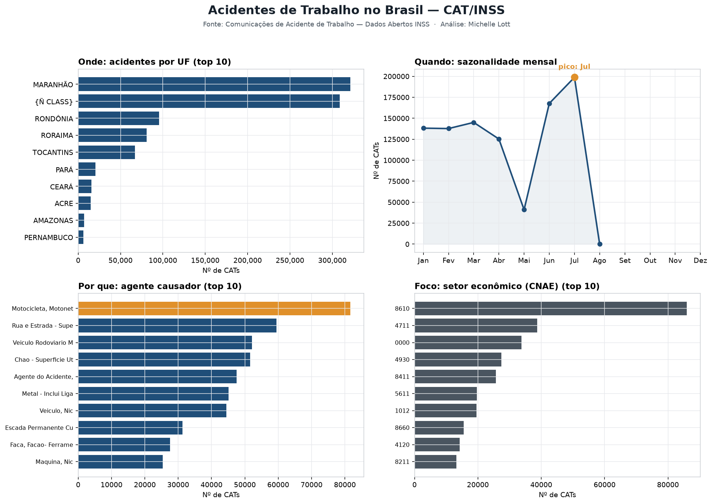

# Análise de Acidentes de Trabalho no Brasil (CAT/INSS)

Análise exploratória das Comunicações de Acidente de Trabalho (CAT) do Brasil,
a partir dos dados abertos oficiais do INSS. O objetivo é identificar **onde,
quando e por que** ocorrem os acidentes, gerando insights para prevenção.

## 📊 Resultado

## 🎯 O projeto

- **Desafio:** entender os padrões dos acidentes de trabalho no país a partir
  de uma base pública grande e "suja".
- **O que fiz:** leitura direta dos arquivos ZIP, tratamento de codificação
  (latin-1) e datas brasileiras, detecção automática de colunas, limpeza e
  análise exploratória cruzando UF, sazonalidade, agente causador e setor (CNAE).
- **Resultado:** identificação dos estados, meses e setores prioritários,
  insumo direto para campanhas de prevenção.

## 🛠️ Ferramentas

Python · pandas · numpy · matplotlib

## ▶️ Como rodar

1. Baixe um ou mais meses (arquivos `.ZIP`) no [portal de dados abertos do INSS](https://dadosabertos.inss.gov.br/dataset/comunicacoes-de-acidente-de-trabalho-cat-plano-de-dados-abertos-jun-2023-a-jun-2025).
2. Crie uma pasta `dados/` e coloque o(s) ZIP(s) lá dentro.
3. Instale as bibliotecas: `pip install pandas numpy matplotlib`
4. Rode: `python analise_acidentes_cat_inss.py`

O script gera o painel (`painel_acidentes_cat.png`) e um resumo por UF (`resumo_por_uf.csv`).

## 📂 Fonte dos dados

[Comunicações de Acidente de Trabalho – CAT | Dados Abertos INSS](https://dadosabertos.inss.gov.br/dataset/comunicacoes-de-acidente-de-trabalho-cat-plano-de-dados-abertos-jun-2023-a-jun-2025) · Licença Creative Commons Attribution.
